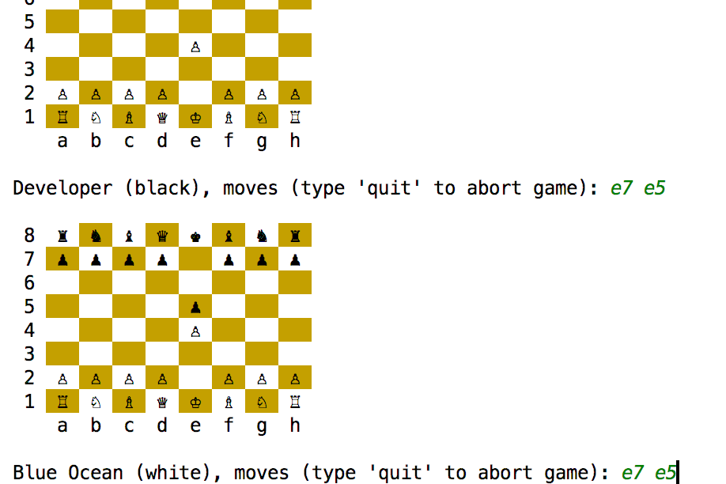

kchess
======

Chess written in functional way using [Scala](https://www.scala-lang.org/) language.

Packages:

* **kchess/app** - is CLI application for playing chess;
* **kchess/chess** - is pure chess API, chess domain, library;
* **kchess/ai** - is simple chess "AI".

